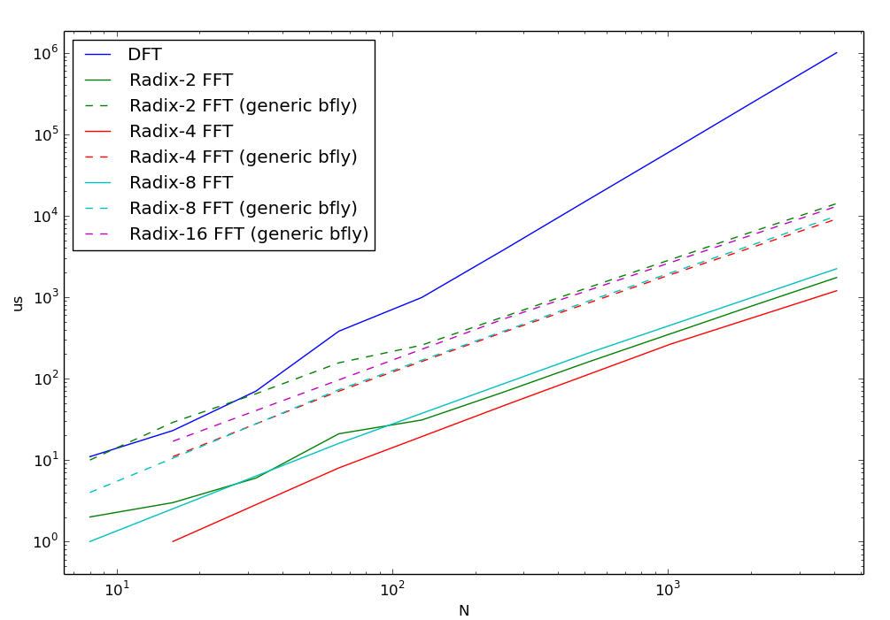
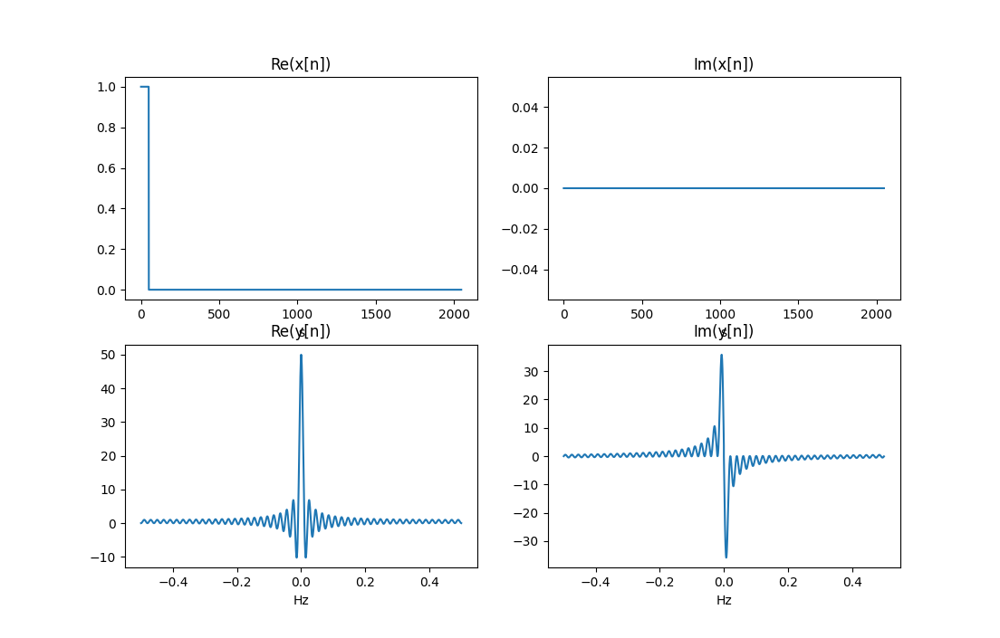
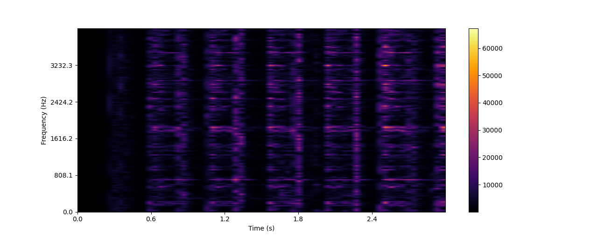

# CM-DSP
CM-DSP is a digital signal processing library written in C++.

## Examples
### FFT
The FFT has been implemented. To build and run it:
```
make fft_example
./fft_example [-n FFT-size] [-r radix-size] [-f file.wav] [-w] [-s] [-b]
```
The default FFT size is 1024 and the default radix size is 2. The FFT size must be a power of the radix size.
* Add the `-w` option to smooth the input signal with a Hann window.
* Add the `-f` option to use a `.wav` file as input. Only PCM-modulated audios with 1 channel are supported.
* Add the `-s` option to save the signal in the time domain and its spectrum in `.txt` files.
* Add the `-b` option to measure the execution time with the [chrono library](https://en.cppreference.com/w/cpp/chrono). The FFTs are run 99 times and the medians are taken. The measurements on the Apple M1 are the following:


You can plot the signal saved in the `.txt` files using the Python3 script `plot.py`. You will need [matplotlib](https://matplotlib.org/).
```
./plot.py [sample_freq]
```


### Filter
A band-pass filter has been implemented. To build and run it:
```
make filter_example
./filter_example -f file.wav [-n FFT-size] [-l low-freq] [-h high-freq] [-s]
```
The default FFT size is 1024 (the radix size is 2). Only PCM-modulated audios with 1 channel are supported.
* Define the lower cutoff frequency with the `-l` option.
* Define the higher cutoff frequency with the `-h` option.
* Add the `-s` option to save the output signal in `.txt` files. You can plot it using `plot.py`.

### Modulation
A modulation example has been implemented. To build and run it:
```
make modulation_example
./modulation_example -f file.wav -m mod-freq [-n FFT-size] [-c carrier]
```
The default FFT size is 1024 (the radix size is 2). Only PCM-modulated audios with 1 channel are supported.
* Define the modulation frequency with the `-m` option.
* Define the carrier type with the `-c` option, `exp` and `cos` are accepted.

The final signal is saved in `.txt` files. You can plot it using `plot.py`.

### Spectrogram
A spectrogram has been implemented. To build and run it:
```
make spectrogram_example
./spectrogram_example -f file.wav [-n FFT-size]
```
The result, a time-frequency matrix, is saved to the `spectrogram.txt` file. It can be plotted (transposed) with:
```
./spectrogram.py [-fs sample-frequency] [-t1 time1] [-t2 time2] [-f1 freq1] [-f2 freq2] [-i interpolation] [-nt time-ticks] [-nf freq-ticks]
```
* Define the sampling frequency with the `-fs` option.
* Define the time interval to show with the `-t1` and `-t2` options.
* Define the frequency interval with the `-f1` and `-f2` options.
* Define the interpolation type with the `-i` option.
* Define the number of axis ticks with the `-nt` and `-nf` options.


## Test
### Complex
To run the complex test routines:
```
make test_complex
./test_complex
```

### FFT
To run the FFT test routines:
```
make test_fft
./test_fft
```

