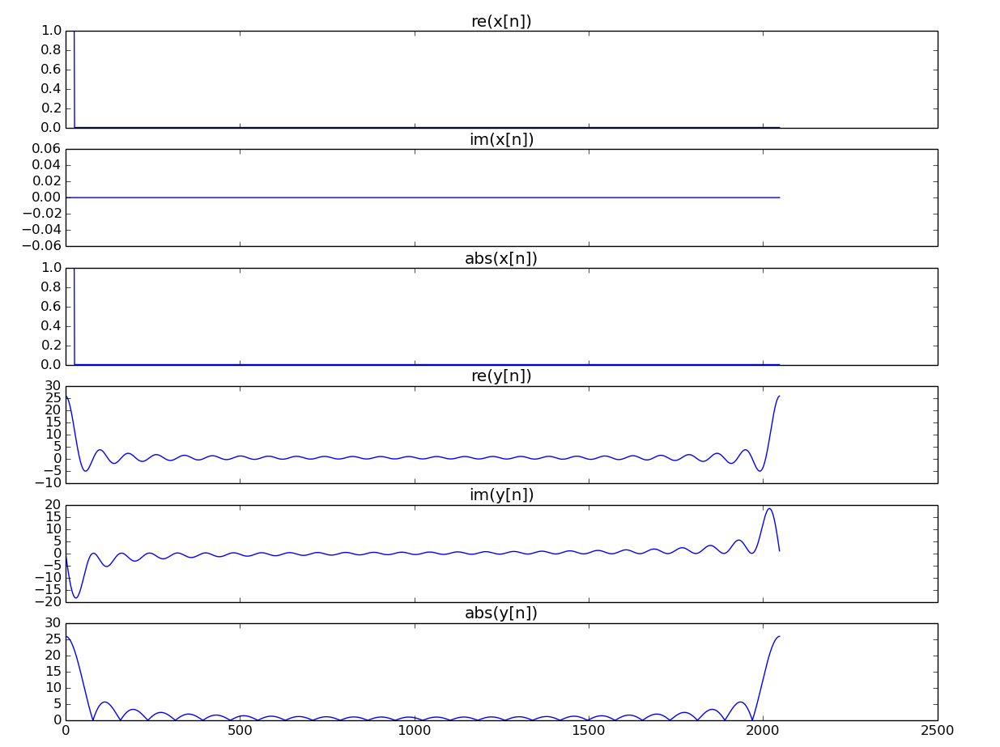

# Complex arithmetic library

A custom complex arithmetic library implemented in c++, for those who cannot rely on [std::complex](https://en.cppreference.com/w/cpp/numeric/complex)

## Getting Started
Add the `complex.hpp` file to your project and start to code using the `Cpx<T>` class.

## Test
To run the test routines:
```
make test
./test
```

## Examples
### FFT
The FFT has been implemented. To build and run it:
```
make fft
./fft -n N -r R
```
where `N` is the FFT size (default is 1024) and R is the radix size (default is 2). N must be a power of R.

* Add the `-s` option to save the input and the output signal in `.txt` files. You can plot them using `plot.py`, you will need [matplotlib](https://matplotlib.org/).



* Add the `-b` option to measure the execution time with the [chrono library](https://en.cppreference.com/w/cpp/chrono). The FFTs are run 99 times and the medians are taken. The measurements on the Apple M1 are the following:


## Version History
* 0.1
    * Initial release

